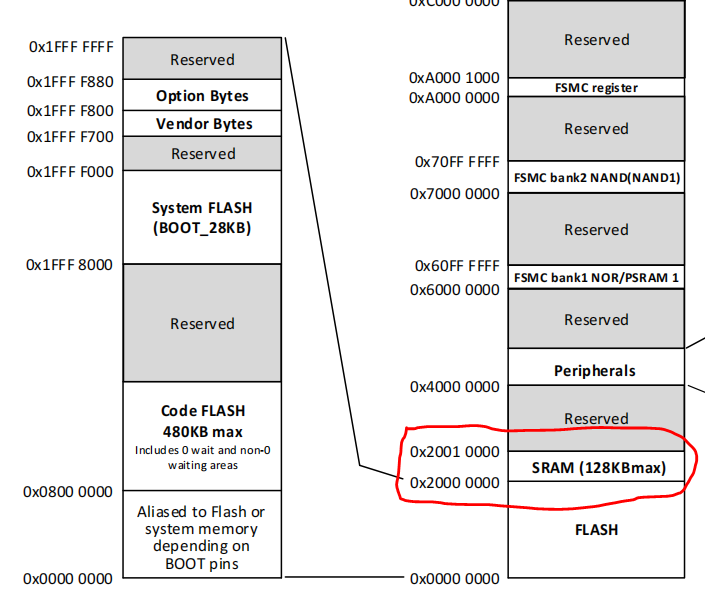

# 启动测试
&emsp;&emsp;项目开始，我对于系统启动的框架甚至都不了解，不知道是如何从启动汇编跳转到我们熟知的c语言程序中的。这需要对MCU内存的FLASH区域和RAM区域有一定的理解，才可以完成这项工作。

&emsp;&emsp;首先让我们看下面这张地址映射图，可以看到FLASH区域从`0x00000000`开始到`0x80000000+480KB`结束。RAM区域从`0x20000000`开始到`0x20010000`结束。因为我的启动模式是从程序闪存存储器启动（也就是BOOT0=BOOT1=0），因此flash空间起始地址为`0x00000000`，在Makefile文件中就需要指定代码段的起始地址为`0x00000000`，并且`start.o`必须是第一个依赖文件（确保首先进入的是汇编程序吧）。编译烧录后使用gdb调试可以观察到系统跳转到了`kernel.c`中的死循环。

    

