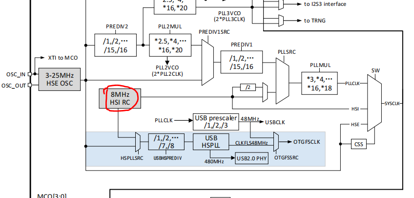
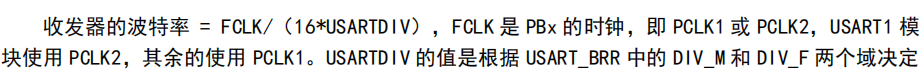
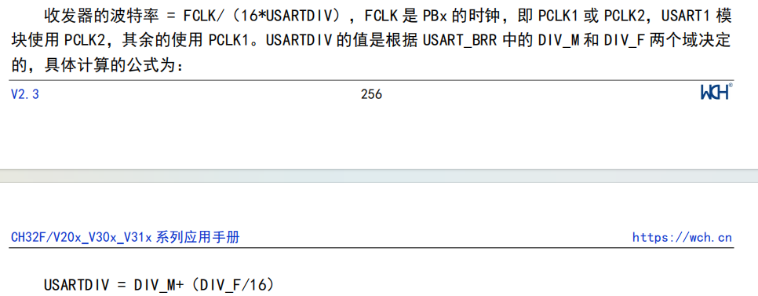
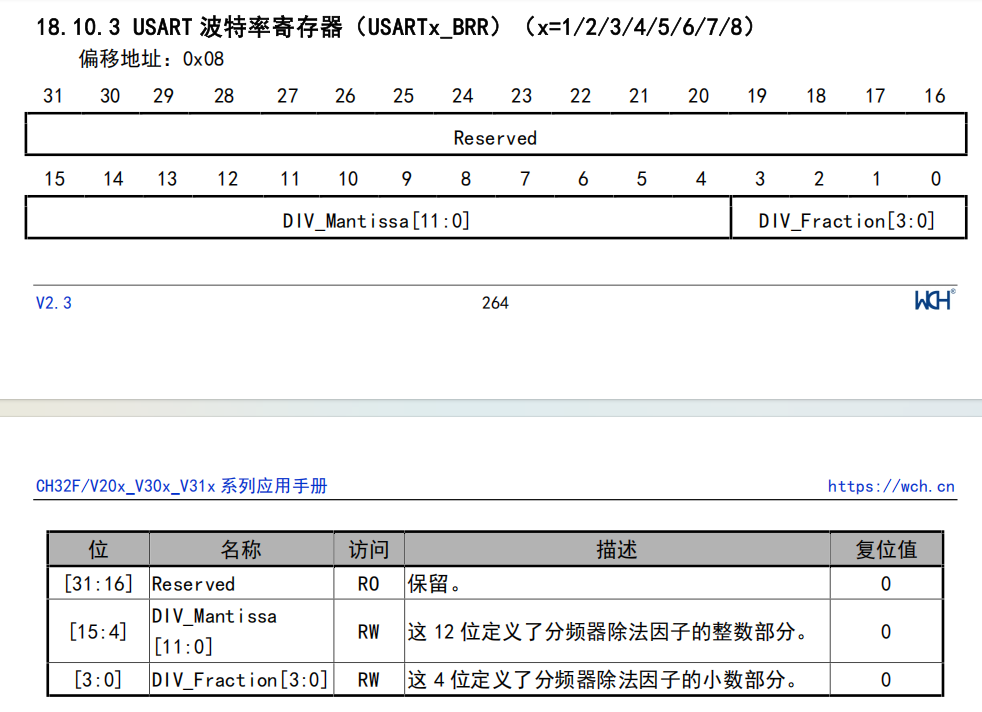
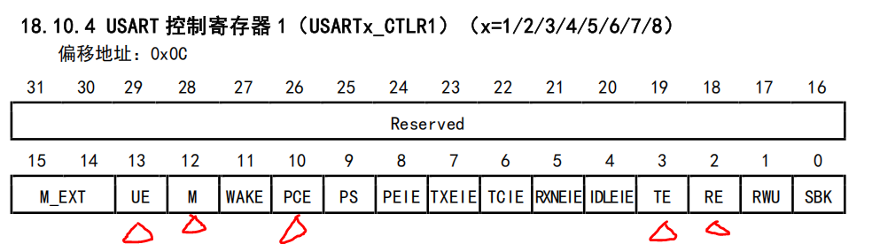

# 配置UART
&emsp;&emsp;关于UART的配置需要参考实际MCU的数据手册，通过阅读手册中UART相关寄存器的内容可以了解到如何成功配置一个UART。我认为主要分为这么几个部分，`UART时钟`、 `波特率`、`数据位校验位起始位`。
### 1、UART时钟
&emsp;&emsp;要配置UART时钟需要能大体读懂时钟树，并确定UART时钟挂载在哪条时钟总线上。时钟树主要关注下图中的部分，从8MHz的内部高速时钟源开始，可以通过PLL倍频产生更高速率的时钟源作为systick系统时钟源，也可以直接输出作为系统时钟源。~~那么这里比较懒因此直接输出作为系统时钟源~~。一般为了更高的性能会去经过PLL倍频。从图中也可以看出systick还有第三个时钟源HSE，是一个外部高速时钟源。

    

&emsp;&emsp;这里使用的是USART1作为系统信息输出串口，因此从文档中可以得知需要使能PCLK2也就是PB2外设时钟。所以要做的步骤就是找到PB2时钟控制寄存器，开启UART相关时钟即可（PB2默认使用不分频的SYSCLK）。

    

### 2、波特率的配置
&emsp;&emsp;波特率计算公式如下，根据`FCLK=8MHz`，收发器波特率设定为`115200`，可以反推出来`USARTDIV$\approx$4.3`。因此整数部分填入`0x100`，小数部分填入`0x0011`。

    

    

### 3、数据位、校验位、起始位
&emsp;&emsp;这三个配置默认就好，8位数据位1位停止位，没有校验位。最后即可正常输出。

    

    

