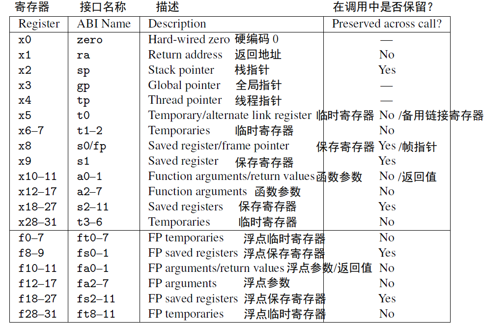
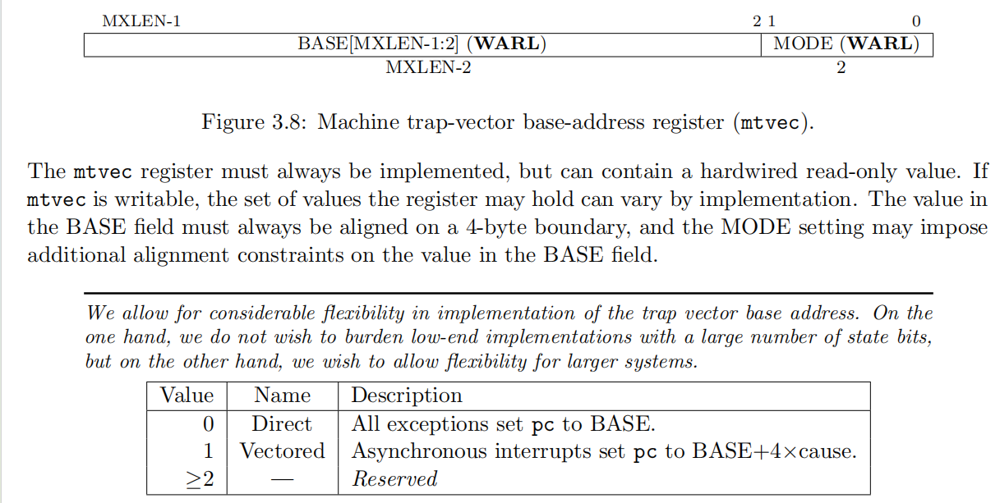

# 上下文切换的实现
&emsp;&emsp;因为ch32v307是risc-v架构的MCU，因此在上下文线程现场保存的时候主要保存了32个通用寄存器以及一个特殊寄存器mepc。保存位置位于内存栈空间的低地址处，因此在分配线程栈空间时，会额外开辟33*4=132字节空间用于上下文的存储。

&emsp;&emsp;在risc-v架构中还有一个特殊寄存器mscratch存储保存上下文的内存栈基地址，在当前线程上下文保存之后把mscratch的值赋值为下一个线程的上下文基地址处，并加载到寄存器中，从而实现了上下文切换。32个通用寄存器表如下。

    

# 中断处理
&emsp;&emsp;中断处理使用了中断向量表跳转的方式。这需要我们在系统初始化的时候把中断向量表的基地址给设置好。比如在这里就是`trap_handler_base`。把基地址设置给`mtvec`，`mtvec`特殊寄存器定义如下图。当MODE位为0时表示同一地址跳转，当MODE位为1时，会根据产生的中断号进行向量跳转。`要注意的是，整个mtvec表示中断基地址，而不是仅高30位。`具体细节见代码。

    

&emsp;&emsp;中断发生时的上下文切换也是差不多的，把当前上下文存储到mscratch所指向的基地址中，然后跳转到中断处理函数，在返回时要注意使用`mret`，mret和ret的区别就是，mret使用mtvec作为返回地址，ret使用ra寄存器的值作为返回地址。