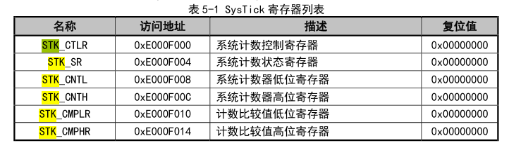

# 硬件定时器
&emsp;&emsp;硬件定时器依靠ch32v307的SYSTICK中断实现。这需要根据你的系统时钟的实际配置，来决定如何给相关计数寄存器赋值。在这颗MCU中，需要操作的相关寄存器是STK寄存器。~~（但是写的时候好像写成了RTK）~~需要根据当前系统计数的值，加上1ms间隔的计数值，如果主频是8MHz的话，这里的间隔值就是8000。确定数值后把对应的间隔tick数写入比较寄存器，并使能系统计数器开始计数。具体请看代码`timer.c:123`。这样就会在每1ms时触发一次Systick中断，并跳转到对应中断处理函数中重新加载计数器的值。

    

# 软件定时器
&emsp;&emsp;软件定时器就是在硬件定时器维护的`__tick`基础上，维护一个定时器列表，其中的定时器按照超时顺序排列。每个软件定时器都会有一个超时tick数，每次systick中断（也就是硬件定时器中断）的时候，会检查这个定时器列表上的第一个，也就是最早超时的定时器，判断定时器属性，比如是否为线程定时器，如果是线程定时器则判断是要挂起线程还是恢复线程调度。 如果不是线程定时器，则执行回调函数（如果有回调函数）。详情见代码`timer.c:80`。