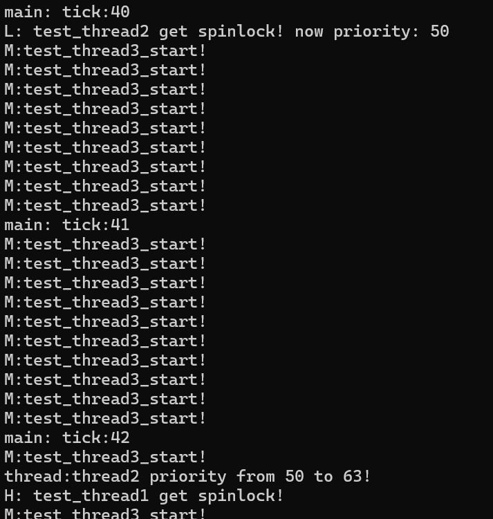

# 自旋锁机制
&emsp;&emsp;此处自旋锁使用了C11标准引入的atomic系列原子操作函数`atomic_flag_test_and_set`以及`atomic_flag_clear`。`atomic_flag_test_and_set`会尝试设置变量值为1，并范围设置之前的值，因此若返回值为1，则不断在while循环中空转，直到时间片耗尽，或被高优先级进程抢占。`atomic_flag_clear`会以原子操作的形式清除变量的值。详见代码lock.c:49。

&emsp;&emsp;因为自旋锁通常用于多核或多cpu之间的并发操作。对于单核多线程而言，线程是串行执行的，而线程的自旋操作会极大影响CPU的运行效率。因此会要求临界区操作尽可能短、快，以尽快释放锁资源，避免自选操作的发生。

# 优先级继承机制
&emsp;&emsp;优先级继承时刻来源于高优先级进程尝试获取锁，而锁被低优先级线程占有。此时就会触发优先级继承机制，把持有锁的线程优先级短暂提高到高优先级线程的优先级。具体操作会把持有锁线程从原优先级队列中移除，随后插入到高优先级就绪队列中。在锁释放时，会判断线程本身是否使用优先级继承机制，如果有则恢复优先级。

&emsp;&emsp;优先级继承测试案例如下，代码详见`main.c`。在此处设置了三个优先级不同的线程，其中高优先级线程和低优先级线程会尝试获取锁，然后休眠（正常不应该休眠），休眠时间不同，然后释放锁。那么必然会造成高优先级线程等待低优先级线程释放锁的情况。此时中优先级线程就会趁机抢占CPU，优先级继承机制成功的避免了这一现象的发生。

&emsp;&emsp;从下图可以看到，tick：42时刻，高优先级线程thread1尝试获取锁，但此时锁被低优先级线程thread2占有，因此thread2执行优先级继承机制，把优先级短暂提升到63，执行完临界区后，thread1获得锁、休眠。中优先级线程thread3才得以执行。

    

