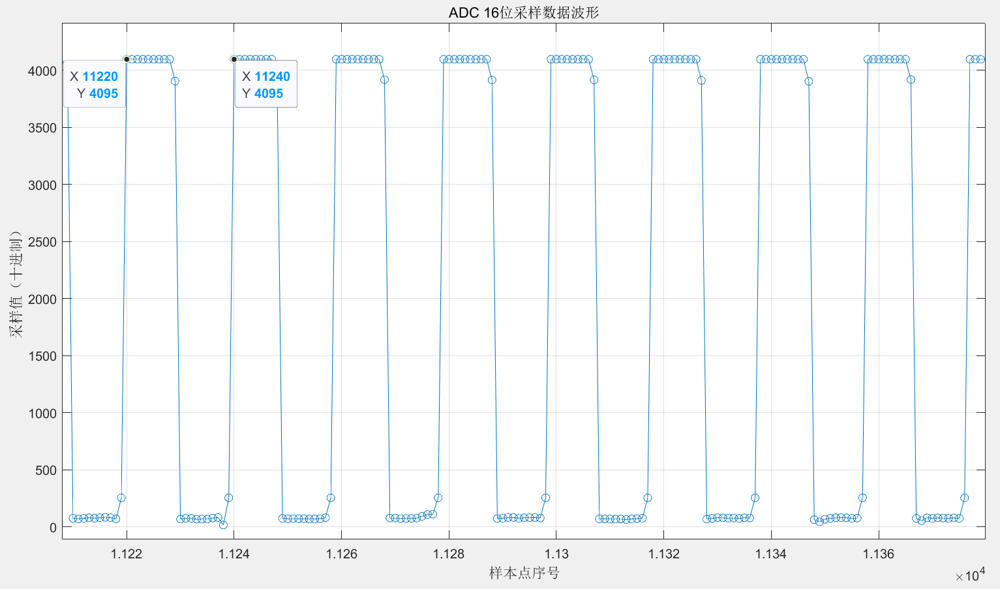
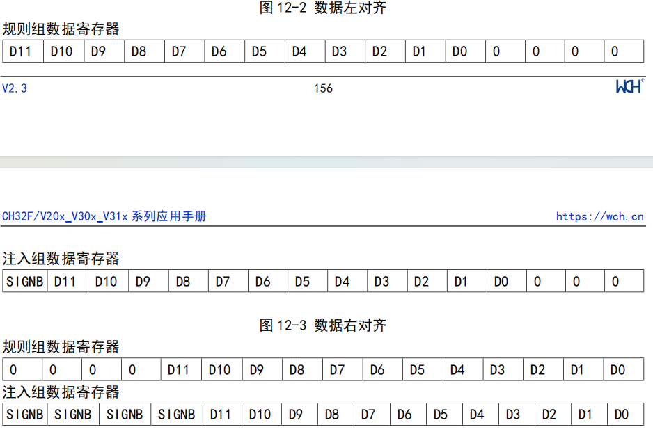

# ADC
&emsp;&emsp;在adc.h头文件中，我们把 ADC 相关寄存器封装在了结构体中，并定义了 ADC 初始化结构体，方便开发中对 ADC 模块进行结构化访问和灵活配置。要注意在配置ADC寄存器时，要先打开ADC时钟，否则相关寄存器不工作，写入操作无效。另外要确定要用到哪个ADC以及哪个通道。注意ADC时钟不可超过14MHz，注意数据对齐方式做好数据接收处理即可。

&emsp;&emsp;在这里将ADC采样时钟配置成了12MHz（主频72MHz做6分频），采样周期为：1.5采样周期+12.5转换周期，共14周期。`由此可得ADC采样频率为：12MHz / 14 ≈ 857kHz`。但是usart波特率经过测试在900kbps时数据会出现一些错位。`所以usart波特率配置为800kbps`。那么可以知道usart支持的ADC采样率最高为`800000 / 10 / 2 = 40kHz`。与ADC采样率有非常明显的差别，由此会造成数据缓冲区重叠。解决方式可以去增加ADC采样周期，降低ADC采样频率。usart与ADC频率匹配后，可以配置DMA传输中断配合实现数据上传。如下是采集40kHz方波的数据图：
<div align=center>
    
</div>

## ✅ ADC 寄存器结构体定义
```c
typedef struct
{
  __IO uint32_t STATR;     // 状态寄存器
  __IO uint32_t CTLR1;     // 控制寄存器1
  __IO uint32_t CTLR2;     // 控制寄存器2
  __IO uint32_t SAMPTR1;   // 采样时间寄存器1（通道10~17）
  __IO uint32_t SAMPTR2;   // 采样时间寄存器2（通道0~9）
  __IO uint32_t IOFR1;     // 注入通道1偏移寄存器
  __IO uint32_t IOFR2;     // 注入通道2偏移寄存器
  __IO uint32_t IOFR3;     // 注入通道3偏移寄存器
  __IO uint32_t IOFR4;     // 注入通道4偏移寄存器
  __IO uint32_t WDHTR;     // 看门狗高阈值寄存器
  __IO uint32_t WDLTR;     // 看门狗低阈值寄存器
  __IO uint32_t RSQR1;     // 规则通道序列寄存器1
  __IO uint32_t RSQR2;     // 规则通道序列寄存器2
  __IO uint32_t RSQR3;     // 规则通道序列寄存器3
  __IO uint32_t ISQR;      // 注入序列寄存器
  __IO uint32_t IDATAR1;   // 注入数据寄存器1
  __IO uint32_t IDATAR2;   // 注入数据寄存器2
  __IO uint32_t IDATAR3;   // 注入数据寄存器3
  __IO uint32_t IDATAR4;   // 注入数据寄存器4
  __IO uint32_t RDATAR;    // 规则数据寄存器
} MC_adc;
```

## ✅ ADC 初始化结构体定义
```c
typedef struct
{
  uint32_t ADC_Mode;                      /* 定义是独立模式还是双ADC采样 */
  FunctionalState ADC_ScanConvMode;       /* 定义采样是扫描模式还是单通道模式 */
  FunctionalState ADC_ContinuousConvMode; /* 定义是单次采样还是连续采样 */
  uint32_t ADC_ExternalTrigConv;          /* 定义ADC采样的外部触发源 */
  uint32_t ADC_DataAlign;                 /* 定义数据对齐方式（左端、右端两种对齐方式） */
  uint8_t ADC_NbrOfChannel;               /* 表明规则通道转换序列中需要转换的通道数目：1~16 */
  uint32_t ADC_Pga;                       /* 指定PGA增益倍数 */
  uint8_t ADC_DMA;                        /*DMA使能*/
}ADC_InitTypeDef;
```

## ADC配置流程

### 1）模块上电
- `ADC_CTLR2` 寄存器的 `ADON` 位为 1 表示 ADC 模块上电。
- 当 ADC 模块从断电模式（`ADON=0`）进入上电状态（`ADON=1`）后，需要延迟一段时间 `tSTAB` 以保证模块稳定。
- 之后再次写入 `ADON=1` 用于软件启动 ADC 转换。
- 通过清除 `ADON=0`，可以终止当前转换并将 ADC 置于断电模式，此时几乎不耗电。

### 2）采样时钟
- 模块寄存器操作基于 `PCLK2`（PB2 总线）时钟。
- 转换单元时钟基准 `ADCCLK` 与 `PCLK2` 同步，由 `RCC_CFGR0` 寄存器的 `ADCPRE[1:0]` 域配置分频。
- 最大采样时钟频率不能超过 14 MHz。

### 3）通道配置
- ADC 模块提供 18 个通道采样源：16 个外部通道 + 2 个内部通道。
- 支持配置到两种转换组：规则组和注入组，实现任意顺序多通道转换。

**转换组说明：**
- **规则组**  
  - 最多支持 16 个转换。  
  - 通道及转换顺序设置在 `ADC_RSQRx` 寄存器中。  
  - 转换数量写入 `ADC_RSQR1` 寄存器的 `L[3:0]`。
- **注入组**  
  - 最多支持 4 个转换。  
  - 通道及转换顺序设置在 `ADC_ISQR` 寄存器中。  
  - 转换数量写入 `ADC_ISQR` 寄存器的 `JL[1:0]`。
> **注**：转换期间如果修改了 `ADC_RSQRx` 或 `ADC_ISQR`，当前转换终止，新启动信号启动新转换组。

**内部通道：**
- 温度传感器：连接 `ADC_IN16`，测量器件周围温度（TA）。
- 内部参考电压：连接 `ADC_IN17`。

### 4）校准
- ADC 内置自校准功能，减少电容变化引起的误差。
- 通过设置 `ADC_CTLR2` 寄存器的 `RSTCAL` 位启动校准寄存器初始化，等待硬件自动清零表示完成。
- 设置 `CAL` 位启动校准，校准完成后硬件自动清除 `CAL` 位，校准码存储在 `ADC_RDATAR` 中。
- 校准建议在 ADC 上电后执行一次。
- **注意**：启动校准前，ADC 必须处于上电状态（`ADON=1`）且持续至少两个 ADC 时钟周期。

### 5）可编程采样时间
- 每个通道采样时间通过 `ADC_SAMPTR1` 和 `ADC_SAMPTR2` 中的 `SMPx[2:0]` 位单独配置。
- 总转换时间计算公式：  
  `T_CONV = 采样时间 + 12.5 × T_ADCCLK`
- 规则通道支持 DMA，转换值存储在 `ADC_RDATAR`。
- 为防止数据未及时读取导致覆盖，可开启 DMA 功能。
- DMA 请求在规则通道转换结束（EOC 置位）时触发，自动传输数据至用户指定地址。
- 配置完成 DMA 通道后，设置 `ADC_CTLR2` 寄存器的 `DMA` 位为 1 启动 DMA。
- **注**：注入组转换不支持 DMA。

### 6）数据对齐
- `ADC_CTLR2` 寄存器的 `ALIGN` 位配置转换数据的对齐方式（左对齐或右对齐）。
- 规则组转换数据存储在 `ADC_RDATAR`，为实际 12 位数字值。
- 注入组数据存储在 `ADC_IDATARx`，为实际转换数据减去偏移寄存器 `ADC_IOFRx` 的值，可能为正负数，带符号位 `SIGNB`。~~以下是从WCH官方手册中偷的数据对齐示意图~~：
<div align=center>
    
</div>


# DMA
&emsp;&emsp;在dma.h文件中，也对DMA相关配置寄存器封装到了结构体中，配置好`DMA_InitTypedef`结构体使用`MC_dma_init`函数以完成dma初始化操作。要注意读取方向和写入方向的数据宽度要匹配，如果不匹配会自动做一些处理。设置ADC数据寄存器地址不递增，内存地址递增。注意确定DMA控制器即DMA通道，DMA循环使能。

## ✅ DMA 寄存器结构体定义
```c
typedef struct {
    __IO uint32_t CFGR;
    __IO uint32_t CNTR;
    __IO uint32_t PADDR;
    __IO uint32_t MADDR;
    uint32_t      RESERVED;
}DMA_Channel_InitTypedef;

typedef struct{
    __IO uint32_t INTFR;
    __IO uint32_t INTFCR;
    DMA_Channel_InitTypedef dma_channel[9];
}MC_dma;
```

## ✅ DMA 初始化结构体定义
```c
typedef struct{
    FunctionalState MEM2MEM; // 存储器到存储器模式使能
    uint8_t PL;              // 通道优先级设置
    uint8_t MSIZE;           // 存储器地址数据宽度 0:8bit, 1:16bit, 2:32bit
    uint8_t PSIZE;           // 外设地址数据宽度
    FunctionalState MINC;    // 存储器地址增量递增模式使能
    FunctionalState PINC;    // 外设地址增量递增模式使能
    FunctionalState CIRC;    // DMA通道循环使能
    FunctionalState DIR;     // 传输方向，0:从外设读, 1:从存储器读
    FunctionalState TEIE;    // 传输错误中断控制使能
    FunctionalState HTIE;    // 传输过半中断控制使能
    FunctionalState TCIE;    // 传输完成中断控制使能
    uint16_t DMA_Channel;    // 选择DMA通道
    uint16_t DMA_X;          // 选择DMA控制器
    uint16_t CNTR;           // 设置DMA传输数目，循环模式自动填充
    uint32_t *PADDR;          // 设置外设地址
    uint32_t *MADDR;          // 设置存储器地址
}DMA_InitTypedef;
```

## DMA 配置流程
1. 在 **DMA_PADDRx** 寄存器中设置外设寄存器的首地址，或在存储器到存储器方式（`MEM2MEM=1`）下设置存储器数据地址。发生 DMA 请求时，该地址将作为数据传输的源或目标地址。

2. 在 **DMA_MADDRx** 寄存器中设置存储器数据地址。发生 DMA 请求时，数据将从该地址读出或写入该地址。

3. 在 **DMA_CNTRx** 寄存器中设置要传输的数据数量。每完成一次数据传输，该数值会递减。

4. 在 **DMA_CFGRx** 寄存器的 **PL[1:0]** 位中设置通道的优先级。

5. 在 **DMA_CFGRx** 寄存器中配置数据传输的方向、循环模式、外设和存储器的增量模式、外设和存储器的数据宽度，以及传输过半、传输完成、传输错误的中断使能位。

6. 设置 **DMA_CCRx** 寄存器的 **ENABLE** 位，启动通道 x。

> **注：**  
> `DMA_PADDRx`、`DMA_MADDRx`、`DMA_CNTRx` 寄存器以及 `DMA_CFGRx` 寄存器中的数据传输方向（DIR）、循环模式（CIRC）、外设和存储器的增量模式（MINC/PINC）等控制位，`只有在 DMA 通道关闭时`才能配置和写入。
